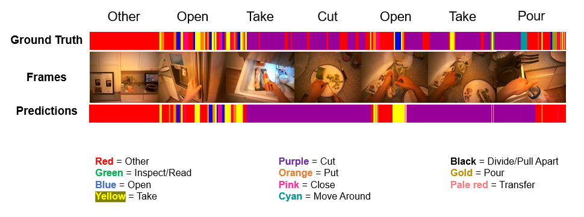

Video classification using LSTM models in PyTorch.

In the first case, an LSTM model is used to classify each video as a whole. Then the model is extended to classify each frame in a video. The model result from one of these frame-wise classifications is shown below:

